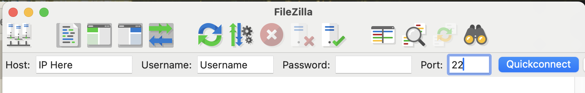

Project description:

For this project, the Nginx conf will be setup like so:

- 1 conf file for web app: 
  - the main conf file will pull the file containing out website nginx conf.
- 1 conf file for each app project:
  - the main conf file will pull one sub-conf file for each additional item, such as a web app.

### Basic steps

- Make sure the URL in app.conf and init-letsencrypt.sh are correct
- Upload the project to your remote server.
  - Filezilla example:
  - 
- Run these commands (permission to run file, file run)
  - ```
    chmod +x init-letsencrypt.sh
    sudo ./init-letsencrypt.sh
    ```
### Full instructions
Full Instructions for getting this running:
https://pentacent.medium.com/nginx-and-lets-encrypt-with-docker-in-less-than-5-minutes-b4b8a60d3a71

(Also in ./backup_files/article_backup/ARTICLE.md)

### Project steps

Then run chmod +x init-letsencrypt.sh and sudo ./init-letsencrypt.sh.


___________ Original doc _________
# Boilerplate for nginx with Let’s Encrypt on docker-compose

> This repository is accompanied by a [step-by-step guide on how to
set up nginx and Let’s Encrypt with Docker](https://medium.com/@pentacent/nginx-and-lets-encrypt-with-docker-in-less-than-5-minutes-b4b8a60d3a71).

`init-letsencrypt.sh` fetches and ensures the renewal of a Let’s
Encrypt certificate for one or multiple domains in a docker-compose
setup with nginx.
This is useful when you need to set up nginx as a reverse proxy for an
application.

## Installation
1. [Install docker-compose](https://docs.docker.com/compose/install/#install-compose).

2. Clone this repository: `git clone https://github.com/wmnnd/nginx-certbot.git .`

3. Modify configuration:
- Add domains and email addresses to init-letsencrypt.sh
- Replace all occurrences of example.org with primary domain (the first one you added to init-letsencrypt.sh) in data/nginx/app.conf

4. Run the init script:

        ./init-letsencrypt.sh

5. Run the server:

        docker-compose up

## Got questions?
Feel free to post questions in the comment section of the [accompanying guide](https://medium.com/@pentacent/nginx-and-lets-encrypt-with-docker-in-less-than-5-minutes-b4b8a60d3a71)

## License
All code in this repository is licensed under the terms of the `MIT License`. For further information please refer to the `LICENSE` file.
